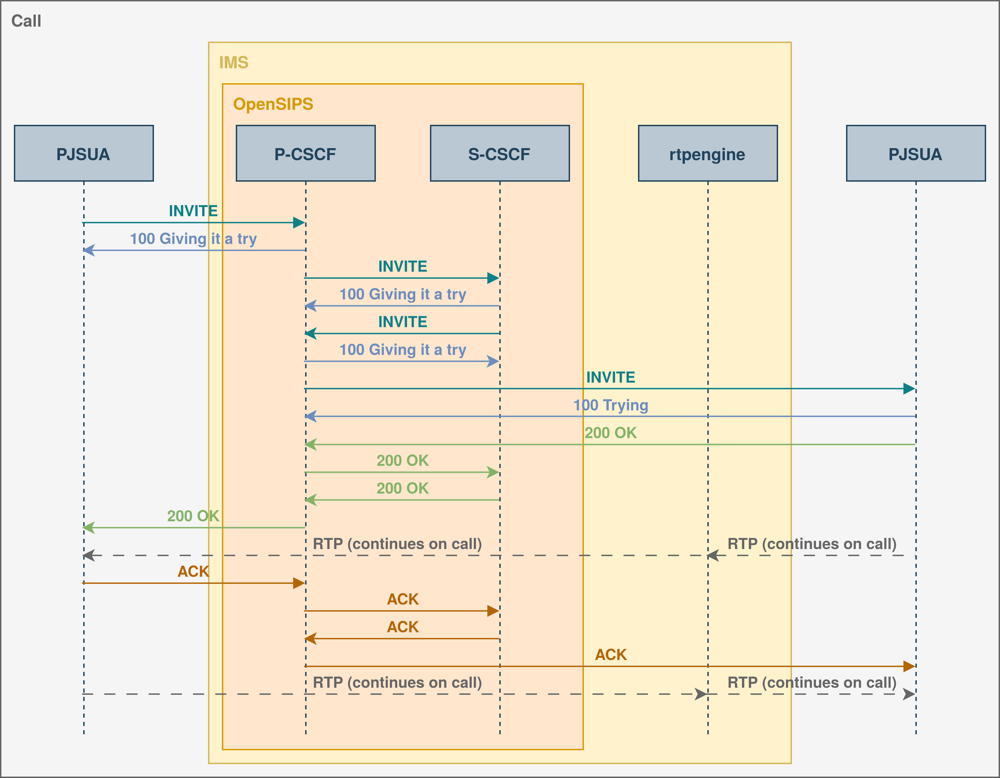

# Exploring an **IMS** deployment without third-party hardware

As part of our constant effort to continually expand our knowledge base, we
wanted to explore the role that an **IP multimedia Subsystem (IMS)** plays on a
communications network.

However we quickly realize that most educational literature assume a fiscal
setup with actual hardware and equipment. Is it not possible, and even
preferable, to get a initial understanding and minimal interactions with this
technologies before diving into expensive purchasing?

We resolved ourselves to do precisely that by trying to get a call working, on
a single host setup, making use of only software-based solutions.

## But what is an **IMS**?

**IMS** is an **IP-based network subsystem developed by 3GPP to provide
multimedia services**, such as voice, video, messaging, and conferencing, over
both mobile and fixed-access networks. **IMS** enables interoperability between
different technologies and facilitates the transition from traditional
**circuit-switched (CS)** networks to fully **packet-based
(IP)** networks.

## Key components


- **Call Session Control Function (CSCF)**

    Call control and session management. Composed of:

    - **Proxy-CSCF (P-CSCF):** Entry point to the **IMS** network.

    - **Interrogating-CSCF (I-CSCF):** Routes **SIP** request towards the
      S-CSCF and assigns it to a user performing registration.

    - **Serving-CSCF (S-CSCF):** Session control services, including acting as
      a _registrar_.

- **Home Subscriber Server (HSS)**

    Database containing user and subscription related information.

## Protocols

### Session Initiation Protocol (SIP)

An application-layer control (signaling) protocol for creating, modifying, and
terminating sessions with one or more participants. These sessions include
Internet telephone calls, multimedia distribution, and multimedia
conferences.[^sip]

### Digest Using Authentication and Key Agreement (AKA)

AKA is a challenge-response based mechanism that uses symmetric cryptography to
authenticate **User Equipments (UEs)**. When working with **IMS** the appropriate
credentials are stored both on the server itself and on the user device.[^aka]

### Diameter Protocol

The **Diameter base protocol** is intended to provide an **Authentication,
Authorization, and Accounting (AAA)** framework for applications such as
network access or **IP** mobility in both local and roaming
situations.[^diameter]

The **Diameter SIP application** allows a client to request authentication and
authorization information for **SIP-based** **IP multimedia services**.
Furthermore, it provides extra functions, such as the ability to download or
receive updated user profiles, or rudimentary routing functions that can assist
a **SIP server** in finding another one allocated to the user.[^diameter-sip]

## Making a call

On a **4G/5G network** a call between two **UE** requires some
setup and can be split into three different stages:

1. **Attach process**

    Refers to the initial authentication and IP assignment of a **UE**. This
    process occurs primarily outside of the **IMS**.

2. **Initial registration**

    The issuing of a `REGISTER` request (**SIP**) by a connecting **UE**, and the
    authorization process involving **AKA** and **Diameter**.

3. **Call setup**

    A normal **SIP** call setup routed by the **IMS**. Usually an **RTP proxy** is
    used to take care of media communication between the devices


## **IMS core** setup

This approach consist of a bare bones **IMS** deployment, making use of the
following services:

- [**OpenSIPS IMS CE**][opensips-ims-ce]
- [**rtpengine**][rtpengine]
- [**PyHSS**][pyhss]

Here, we discard the **Core Network** in which the **IMS** is supposed to run and
generate **SIP trafic** using 2 [**PJSUA**][pjsua] clients that simulate our
endpoint devices.

In order to correctly authenticate some arguments are needed:

```bash
pjsua \
    --registrar=sip:ims.mnc001.mcc001.3gppnetwork.org \
    --id=sip:<imsi>@ims.mnc001.mcc001.3gppnetwork.org \
    --nameserver=<dns> \
    --proxy sip:pcscf.ims.mnc001.mcc001.3gppnetwork.org \
    --realm=ims.mnc001.mcc001.3gppnetwork.org \
    --username=<imsi>@ims.mnc001.mcc001.3gppnetwork.org \
    --password="$(echo <aka_k> | xxd -r -p)" \
    --aka-op="<aka_op>" \
    --aka-amf="<aka_amf>" \
    --use-ims
```

> **ℹ️ Note**  
> Keep in mind that `--aka-op` and `--aka-amf` options weren't part of 
> **PJSUA** cli interface until [this commit][pjsua-aka] and are only available 
> for version 2.16 and onward.

### Registration


### Call



## Simulate a 4G network

We can also try to more fitfully recreate a real deployment by using the 
[**docker open5gs** repo][docker_open5gs] as a starting point. One of the 
included setup describes a 4G deployment to which a simulated **UE** can 
connect to. However, as is there is no way to generate **SIP** traffic from 
that device to the **IMS**, so to fix that we'll need to use the `srslte` image 
as a base on top of which we'll build our **PJSUA** clients and route their 
traffic trough the **TUN** interface that encapsulates and simulates the radial 
network.

## Conclusion

We have demonstrated that for simple setups focusing on the core
functionalities of **IMS** it is totally possible to use simulated devices and
local setups without extra hardware, there's also promise in the simulation of
radial networks with tools like [**ZeroMQ**][zmq] and [**srsRAN**][srsran] for
more complete and in depth setups.

<!-- links -->

[opensips-ims-ce]: <https://github.com/OpenSIPS/opensips-ims-ce>
[rtpengine]: <https://github.com/sipwise/rtpengine>
[pyhss]: <https://github.com/nickvsnetworking/pyhss>
[pjsua]: <https://github.com/pjsip/pjproject>
[pjsua-aka]: <https://github.com/pjsip/pjproject/commit/a6e13db2d440724ce75e53df548e5308804d31d3>
[docker_open5gs]: <https://github.com/herlesupreeth/docker_open5gs>
[zmq]: <https://zeromq.org/>
[srsran]: <https://www.srsran.com/>


<!-- references -->

[^aka]:  
    Niemi, A., Arkko, J., and V. Torvinen, "Hypertext Transfer Protocol (HTTP)
    Digest Authentication Using Authentication and Key Agreement (AKA)", RFC 3310,
    DOI 10.17487/RFC3310, September 2002,
    <https://www.rfc-editor.org/info/rfc3310>.

[^sip]: 
    Rosenberg, J., Schulzrinne, H., Camarillo, G., Johnston, A., Peterson, J.,
    Sparks, R., Handley, M., and E. Schooler, "SIP: Session Initiation Protocol",
    RFC 3261, DOI 10.17487/RFC3261, June 2002,
    <https://www.rfc-editor.org/info/rfc3261>.

[^diameter]: 
    Fajardo, V., Ed., Arkko, J., Loughney, J., and G. Zorn, Ed., "Diameter Base
    Protocol", RFC 6733, DOI 10.17487/RFC6733, October 2012,
    <https://www.rfc-editor.org/info/rfc6733>.

[^diameter-sip]:
    Garcia-Martin, M., Ed., Belinchon, M., Pallares-Lopez, M., Canales-Valenzuela,
    C., and K. Tammi, "Diameter Session Initiation Protocol (SIP) Application", RFC
    4740, DOI 10.17487/RFC4740, November 2006,
    <https://www.rfc-editor.org/info/rfc4740>.
